<h1> Nom de l'exposition : PROJET ARSENAL</h1>
  
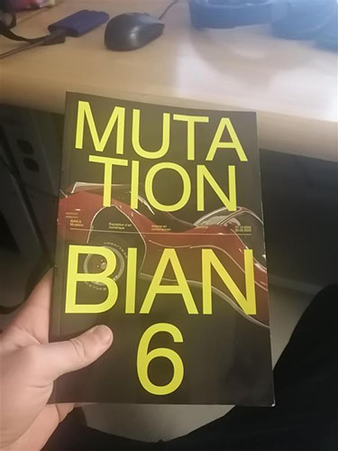
  
<h3> Adresse : 2020 Rue William, Montréal, QC H3J 1R8 </h2>

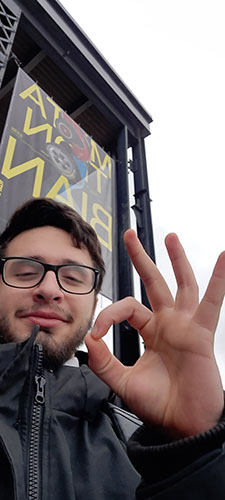

<h3> Type d'exposition : temporaire </h3>
<h3> Date de la visite : 2 février 2023 </h3>
<h3> Titre de l'oeuvre : Copacabana Machine Sex </h3>

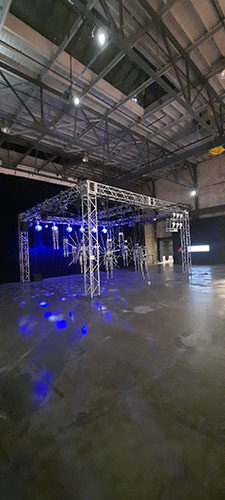

<h3> Nom de l'artiste : Bill Vorn </h3>

<h3> Année de réalisation	: 2018 </h3>

<h4> Description de l'oeuvre : Copacabana Machine Sex est une performance robotique musicale dans laquelle les machines sont à la fois actrices et danseuses. Il 
explore la forme et le mouvement des robots à travers la musique, le son et la lumière. Le titre de la pièce fait également référence à un certain nombre de boîtes de nuit appelées Copacabana. </h4>

<h4> Selon le cartel afficher devant l'oeuvre, Bill Vorn est un artiste travaillant dans le champ de l'art robotique depuis près de 30 ans. Ses projets d'installation et de performance impliquent le contrôle du mouvement, le son, l'éclairage, la vidéo et les processus cybernétiques. Influencé par les progrès des interactions humain-robot, il poursuit un travail artistique basé sur la "robotique relationnelle". Ses oeuvres ont été présentées dans de nombreux événements internationaux dont Ars Electronica (Linz, Autriche), Sonar (Barcelone, Espagne) et Art Futura (Barcelone, Espagne). </h4>

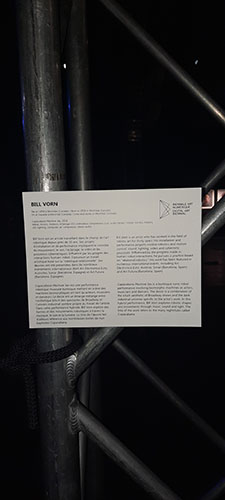
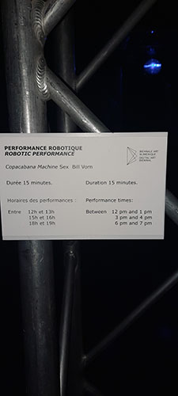

<h3> Type d'installation : contemplative et immersive </h3>

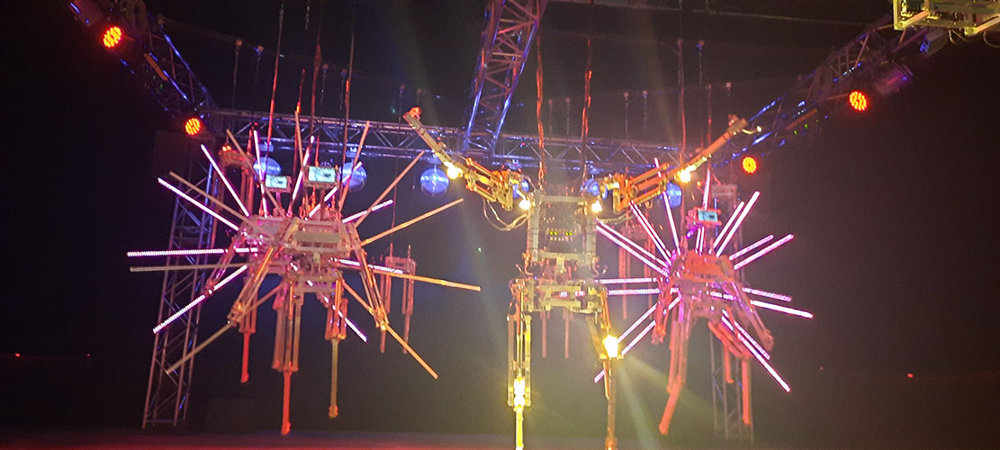

<h4> L'œuvre est dans une salle dédiée aux installations multimédias. Il est délimité par quatre poteaux métalliques, étant relié entre eux sur le dessus. La pièce forme un cube. Dans celui-ci se trouvent plusieurs robots étant suspendu par des câbles. </h4>

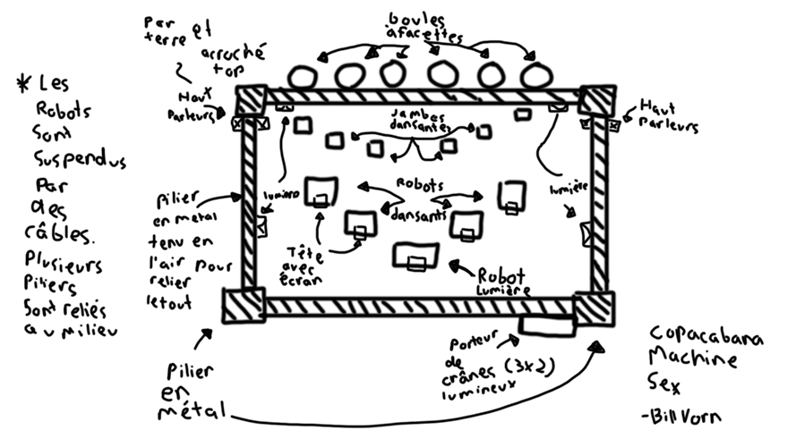

<h3> Composantes</h3>

* Métal miroirs 

* moteurs 

* éclairage LED 

* ordinateur 

* compresseur à air

* audio stéréo

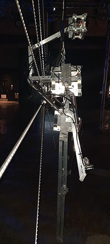
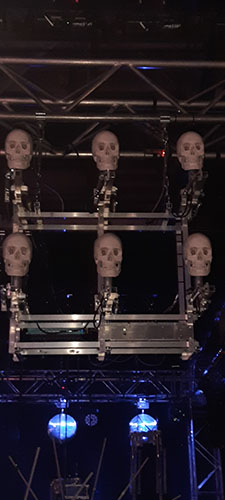
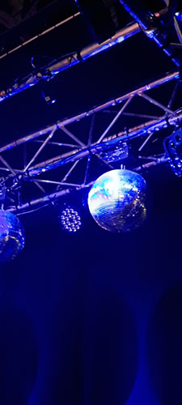
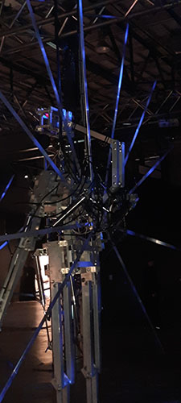
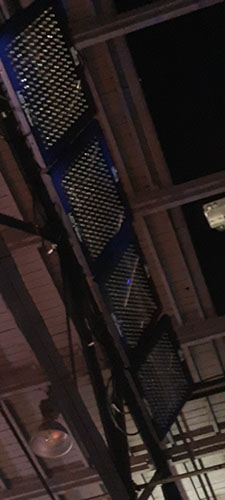
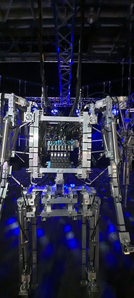

<h4> Éléments nécessaires à la mise en exposition	<h4>

  
  * Les poteaux métaliques
  
  * Les câbles tenants en suspension les robots
  
  * Papier collant eletrique afin de sécuriser les robots
 
  
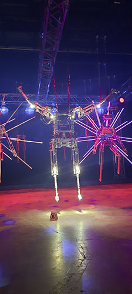
  
  <h4> Expérience vécue : L'oeuvre se trouve être comme un spectacle, les spectateurs se positionnent assis ou debout devant les robots et les regarde danser. Cela dure environ 12-13 minutes. Personnellement, j'ai trouvé l'oeuvre spectaculaire mais j'ai tout de même eu l'impression qu'il se répetait beaucoup me lassant après 5 minutes. J'ai beaucoup aimé les jeux de lumière mais le robot principal (celui en avant) gachais tout avec les lumières trop fortes </h4>
  <h4> Voici une vidéo de l'oeuvre en action : https://youtu.be/YsYKgti_BAU </h4>
  
  <h4> Ce qu'il m'a plu : J'ai beaucoup apprécié le principe futuriste du projet, le fait que les robots devraient être aussi divertis dans le futur est intéressant. Les jeux de lumière étaient aussi superbes j'aimerais aussi faire des projets aussi impressionnant que celui-ci. Il y a tellement de détail que j'avais toujours quelques choses à regarder. </h4>
  
  
  
  
  
  

  

  
  
