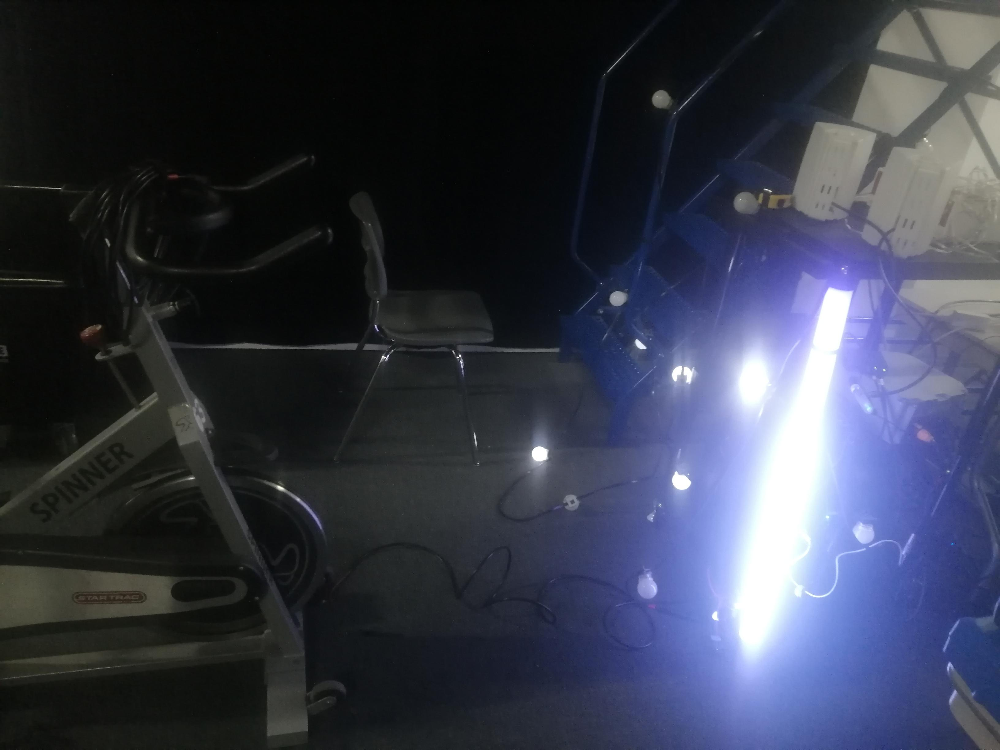
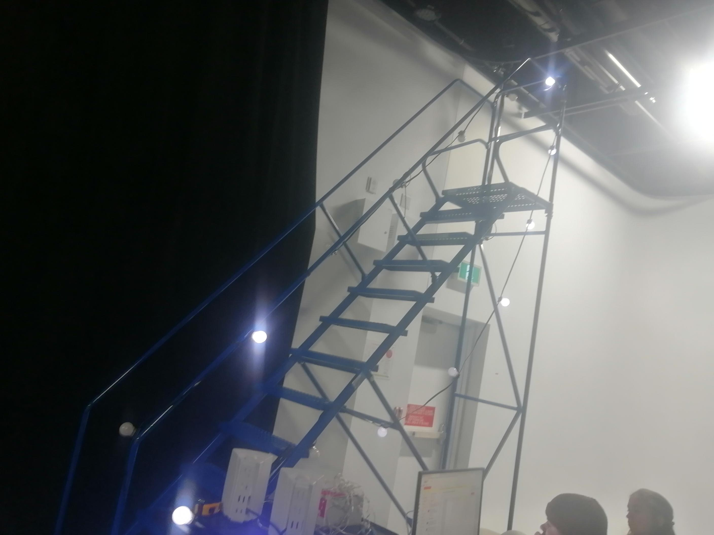
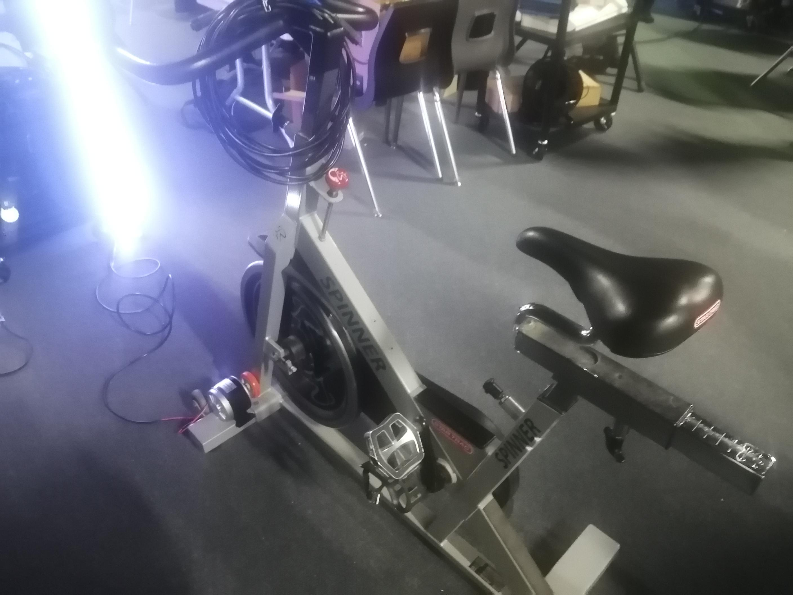
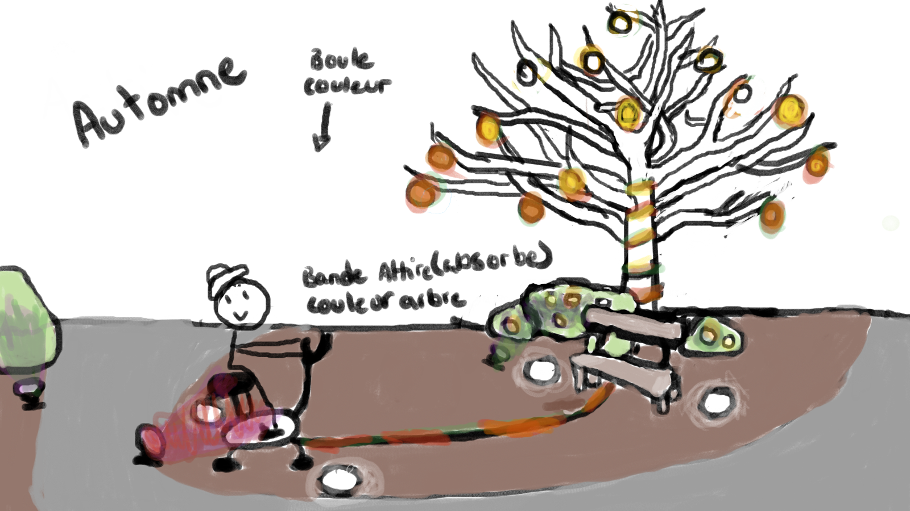
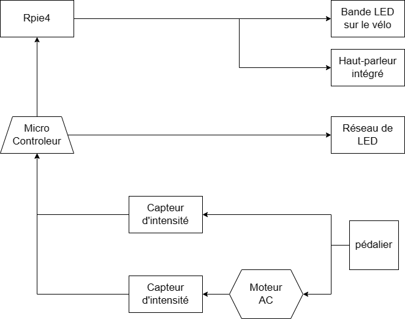

<h1> Lumasol </h1>  
<h2> Les créateurs et créatrices de ce projets </h2>

* Éloïse Gagné
* Skayla Stimphil
* Michaël Simard
* Pénélope Morrisson

<h2> Le lien avec le thème Mycélium </h2>

 Personnellement, je pense que ce qui relie le thème du mycélium au projet Lumasol est un phénomène audiovisuel qui découle de sa nature technique fictive.   
En effet, lors de la présentation de ce projet, les créateurs et créatrices nous ont décrit l'oeuvre ; elle consiste en un vélo modifié qui permet de charger des USB pour les téléphones en pédalant. En pédalant, les participants activent également des lumières et de la musique qui changent pour représenter les quatre saisons.   
L'installation invite les participants à participer activement à l'œuvre, en utilisant leur propre énergie pour alimenter le système. Les lumières et la musique qui changent au fil des saisons créent une ambiance visuelle et sonore immersive, transportant les participants dans un univers poétique et évocateur.

    <table>
	    <tr>
    	    <td style="padding:10px">
        	     
      	    </td>
            <td style="padding:10px">
            	
            </td>
            <td style="padding:10px">
            	
            </td>
        </tr>
    </table>

 Vous pouvez observer par-dessus l'installation qui se trouve dans le studio. Sachez que ceci n'est aucunement l'apparence du projet final. C'est principalement un prototype pour être certain de celui-ci fonctionne parfaitement. Par exemple, lors de la présentation, ils nous ont expliqué que le vélo serait complètement modifié afin de faire dérouler l'oeuvre mais pour le moment, ils ont emprunté un vélo de spinning pour la démonstration. 

<h2> Les schémas de l'installation prévue </h2>

    <table>
	    <tr>
    	    <td style="padding:10px">
        	     
      	    </td>
            <td style="padding:10px">
            	
            </td>
	    <td style="padding:10px">
            	
            </td>
        </tr>
	    <h5> Ces images proviennent tous du site : https://tim-montmorency.com/2023/projets/LumaSol/docs/web/index.html </h5>
    </table>
	<h2> Les cours incontournables afin d'avoir les compétences de ce projet </h2>

 Personnellement, je n'ai pas encore suivi tous les cours sur cette technique, mais à en juger par les informations que j'ai reçues lors des présentations, je pense pouvoir deviner. Selon moi, il s'agirait des cours suivants : Interactivité ludique, Traitement audiovisuel et Objets interactifs. 

		

 Premièrement, le cours "Interactivité ludique" serait utile pour apprendre à concevoir une expérience interactive. L'installation utilise un vélo modifié pour encourager les participants à pédaler et à interagir avec l'œuvre, ce qui correspond parfaitement à l'objectif de ce cours.

	

 Deuxièmement, le cours "Traitement audiovisuel" serait également important, car il permettrait aux étudiants d'apprendre à manipuler les techniques audiovisuels pour créer une expérience immersive. Dans l'oeuvre que j'ai visité, les lumières et la musique changent pour représenter les quatre saisons, ce qui nécessite une compréhension des techniques de traitement audiovisuelles. 

 Pour terminer, le cours "Objets interactifs" serait essentiel pour apprendre à concevoir et à programmer des dispositifs interactifs tels que le vélo modifié utilisé dans l'installation. Ce cours permettrait également d'explorer les différentes façons de connecter des objets physiques à des systèmes technologique, ce qui est une compétence clé pour la réalisation de toute installation interactive. 

