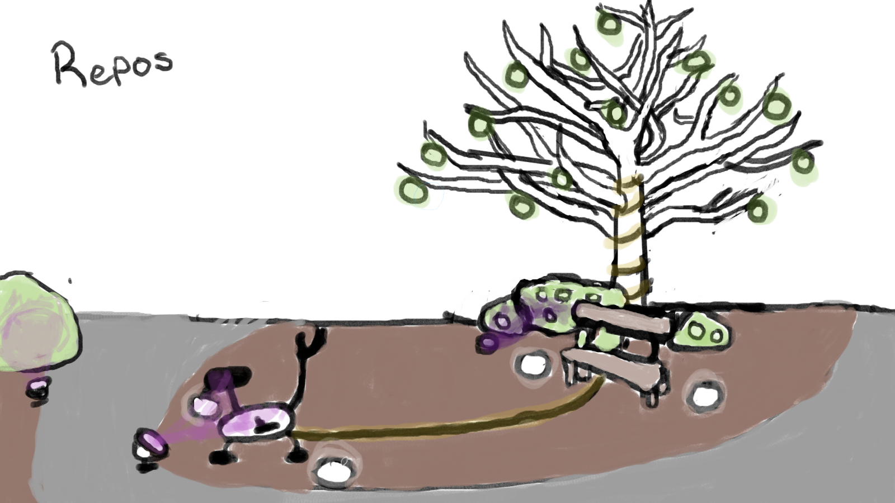
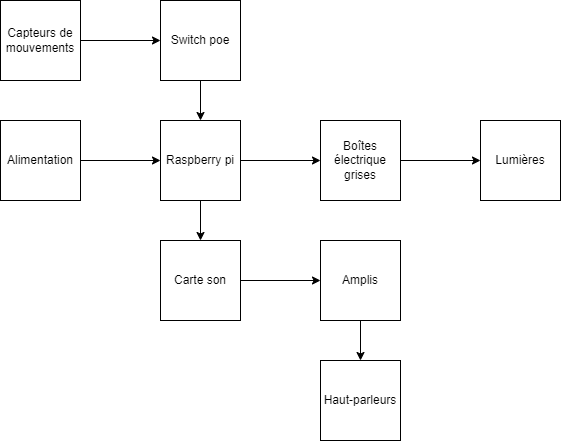
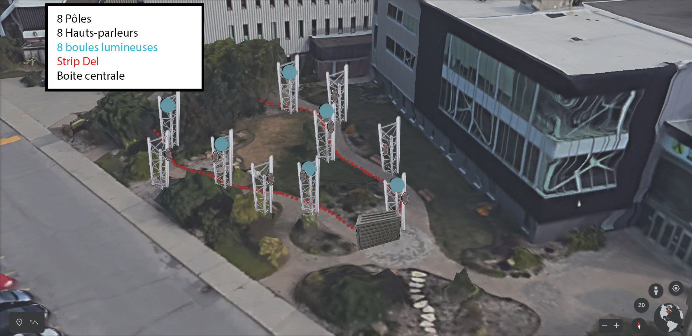
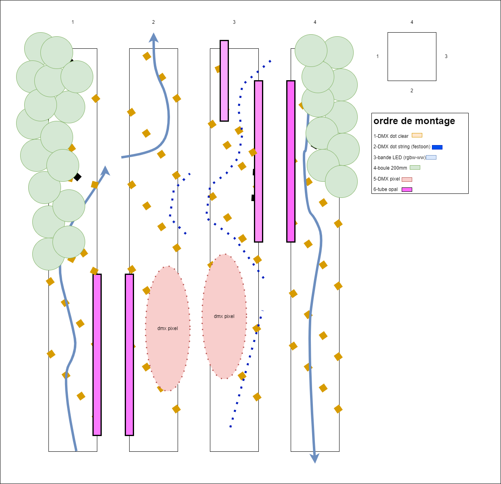

<h1> Lumasol </h1>
<h2> Les créateurs et créatrices de ce projets </h2>

* Éloïse Gagné
* Skayla Stimphil
* Michaël Simard
* Pénélope Morrisson

<h2> Le lien de Lumasol avec le thème Mycélium </h2>

 Personnellement, je pense que ce qui relie le thème du mycélium au projet Lumasol est un phénomène audiovisuel qui découle de sa nature technique fictive.   
En effet, lors de la présentation de ce projet, les créateurs et créatrices nous ont décrit l'oeuvre ; elle consiste en un vélo modifié qui permet de charger des USB pour les téléphones en pédalant. En pédalant, les participants activent également des lumières et de la musique qui changent pour représenter les quatre saisons.   
L'installation invite les participants à participer activement à l'œuvre, en utilisant leur propre énergie pour alimenter le système. Les lumières et la musique qui changent au fil des saisons créent une ambiance visuelle et sonore immersive, transportant les participants dans un univers poétique et évocateur.

    <table>
	    <tr>
    	    <td style="padding:10px">
        	     
      	    </td>
            <td style="padding:10px">
            	
            </td>
            <td style="padding:10px">
            	
            </td>
        </tr>
    </table>

 Vous pouvez observer par-dessus l'installation qui se trouve dans le studio. Sachez que ceci n'est aucunement l'apparence du projet final. C'est principalement un prototype pour être certain de celui-ci fonctionne parfaitement. Par exemple, lors de la présentation, ils nous ont expliqué que le vélo serait complètement modifié afin de faire dérouler l'oeuvre mais pour le moment, ils ont emprunté un vélo de spinning pour la démonstration. 

<h2> Les schémas de l'installation prévue </h2>

    <table>
	    <tr>
    	    <td style="padding:10px">
        	     
      	    </td>
            <td style="padding:10px">
            	
            </td>
	    <td style="padding:10px">
            	
            </td>
        </tr>
	    <h5> Ces images proviennent tous du site : https://tim-montmorency.com/2023/projets/LumaSol/docs/web/index.html </h5>
    </table>

<h1> Nexum </h1>
<h2> Les créateurs et créatrices de ce projets </h2>

* Sébastien Reilly
* Sabrina Laforest
* Alexandre Daniel
* Maxime Des Lauriers

<h2> Le lien avec le thème Mycélium </h2>
	

 Le projet mycélium montre comment la technologie peut être utilisée pour connecter la vie humaine tout en respectant l'echosysteme. En utilisant des matériaux durables pour résister a l'hiver, les projets peuvent être créés pour illuminer les chemins des humains tout en préservant la santé de celui-ci. 

	

    <table>
	    <tr>
    	    <td style="padding:10px">
        	     
      	    </td>
            <td style="padding:10px">
            	
            </td>
            <td style="padding:10px">
            	
            </td>
        </tr>
    </table>

Vous pouvez observer dans ces images l'installation non permanente d'un projet éclairant des chaises. Lors de notre visite, nous avons pu constater que ce projet se composait d'une longue guirlande lumineuse. Lors de la présentation, les créateurs nous ont expliqué son fonctionnement : des détecteurs de mouvements seraient placés aux extrémités du chemin, de sorte que lorsque quelqu'un passerait devant, une ligne d'ampoules dans des bulles s'allumerait pour éclairer le chemin. 

<h2> Les schémas de l'installation prévue </h2>

    <table>
	    <tr>
    	    <td style="padding:10px">
        	     
      	    </td>
            <td style="padding:10px">
            	
            </td>
            <td style="padding:10px">
            	
            </td>
		<h5> Ces images proviennent tous du site : https://tim-montmorency.com/2023/projets/Nexum/docs/web/preproduction.html </h5>
        </tr>
    </table>

	
<h1> EDRIA </h1>
<h2> Les créateurs et créatrices de ce projets </h2>

* Elwin Durand
* Loic Delorme
* Dominic Roberts
* Gabriel Leblanc
* Meryem Berbiche
* Jean-Christophe
	
<h2> Le lien avec le thème Mycélium </h2>

Nous pouvons observer la connexion entre ce projet et l'interaction de groupe que les gens peuvent avoir avec cette technologie naturelle. En effet, en étant autour des piliers, des effets apparaissent, créant ainsi des connexions entre les personnes présentes. Cette installation met en lumière la façon dont la technologie peut rassembler les gens, et comment elle peut être utilisée pour renforcer les interactions sociales et la communauté.
	

    <table>
	    <tr>
    	    <td style="padding:10px">
        	     
      	    </td>
            <td style="padding:10px">
            	
            </td>
            <td style="padding:10px">
            	
            </td>
        </tr>
    </table>

 En observant ces images, nous pouvons constater qu'il s'agit simplement d'un poteau métallique, équipé d'un éclairage et d'un haut-parleur. Toutefois, il y a bien plus d'intérêt que cela. En effet, lors de la présentation, les créateurs nous ont expliqué que cette installation était destinée à un groupe de personnes. Le projet consiste à jouer de la musique et des lumières lorsque quelqu'un se place sur l'un des quatre côtés du poteau. Chaque côté possède des couleurs et des sons différents, permettant ainsi de les connecter lorsque quatre personnes sont présentes autour de l'installation. 

	

    <table>
	    <tr>
    	    <td style="padding:10px">
        	     
      	    </td>
            <td style="padding:10px">
            	
            </td>
            <td style="padding:10px">
            	
            </td>
		 <h5> Ces images proviennent tous du site : https://tim-montmorency.com/2023/projets/EDRIA/docs/web/preproduction.html </h5>
        </tr>
    </table>

<h1> Echomarine </h1>	
<h2> Les créateurs et créatrices de ce projets </h2>

* Florence Lapierre
* Natacha Abdallah
* Tracy Gua
* Maria Laura Coronel
	
<h2> Le lien avec le thème Mycélium </h2>
Je ne suis pas sûr de comprendre le lien avec le mycélium, mais j'imagine que ce projet vise à établir une connexion entre l'homme et la nature. En effet, étant donné que ce projet aborde la question des animaux en voie de disparition, il cherche à sensibiliser davantage le public à la préservation de la nature et de la biodiversité. Cette installation peut être considérée comme un moyen de créer une prise de conscience chez les spectateurs en leur montrant de manière ludique et artistique les conséquences de l'impact de l'homme sur l'environnement et les espèces qui y vivent.
	

    <table>
	    <tr>
    	    <td style="padding:10px">
        	     
      	    </td>
            <td style="padding:10px">
            	
            </td>
            <td style="padding:10px">
            	
            </td>
        </tr>
    </table>

 En observant ces images, nous pouvons voir qu'il s'agit d'une petite salle entourée d'eau, éclairée par des projecteurs. Les créateurs du projet nous ont expliqué que l'objectif était de faire apparaître des animations d'animaux en voie de disparition lorsqu'on cliquera sur leur description affichée sur une tablette. Cette installation vise à sensibiliser le public à la préservation des espèces menacées et à leur habitat naturel. 

	

    <table>
	    <tr>
    	    <td style="padding:10px">
        	     
      	    </td>
            <td style="padding:10px">
            	
            </td>
            <td style="padding:10px">
            	
            </td>
		 <h5> Ces images proviennent tous du site : https://tim-montmorency.com/2023/projets/Echomarine/docs/web/index.html </h5>
        </tr>
    </table>

<h2> Les cours incontournables afin d'avoir les compétences de ces projet </h2>

 Personnellement, je n'ai pas encore suivi tous les cours sur cette technique, mais à en juger par les informations que j'ai reçues lors des présentations, je pense pouvoir deviner. Selon moi, il s'agirait des cours suivants : Interactivité ludique, Traitement audiovisuel et Objets interactifs. 

		

 Premièrement, le cours "Interactivité ludique" serait utile pour apprendre à concevoir une expérience interactive. Par exemple, l'installation de lumasol utilise un vélo modifié pour encourager les participants à pédaler et à interagir avec l'œuvre, ce qui correspond parfaitement à l'objectif de ce cours.

	

 Deuxièmement, le cours "Traitement audiovisuel" serait également important, car il permettrait aux étudiants d'apprendre à manipuler les techniques audiovisuelles pour créer une expérience immersive. Plusieurs œuvres que j'ai visité ont de la musique. Cela nécessite une compréhension des techniques de traitement audiovisuelles. 

 Pour terminer, le cours "Objets interactif" serait essentiel pour apprendre à concevoir et à programmer des dispositifs interactifs tels que le vélo modifié utilisé dans l'installation de lumasol. Ce cours permettrait également d'explorer les différentes façons de connecter des objets physiques à des systèmes technologiques, ce qui est une compétence clé pour la réalisation de toute installation interactive. 

<h2> Une composante inconnue du projet </h2>

 Personnellement, je n'sais pas comment fonctionne l'outil afin de détecter les mouvements. Pour plus de détails, lors de la rotation de la roue, tout le système démarre. Je n'sais pas quel détecteur de mouvements qu'il s'agit alors je me suis informé sur les détecteurs à infrarouge. Selon les informations que j'ai récupérer, celui-ci permet d'analyser la chaleur dégagée. La chaleur émise par la roue produit un rayonnement infrarouge. Grâce à ce rayonnement infrarouge, des capteurs peuvent détecter la présence du mouvement. 

<h5> Les informations ont été récuperer depuis le site : https://www.nexecur.fr/detecteur-de-mouvement-infrarouge-comment-fonctionne#:~:text=Le%20d%C3%A9tecteur%20de%20mouvement%20est,d%C3%A9tecter%20la%20pr%C3%A9sence%20d'intrus </h5>
<h2> Mon jugement final</h2>

 Grâce aux nombreuse informations que j'ai reçues lors de la visite, je crois que lumasol serait mon projet préféré. J'aime beaucoup le concept de voyager parmi les quatre saisons nous faisant réfléchir sur nos impacts sur l'environnement. J'imagine que ce projet parle de ce que grâce au vélo produisant aucune pollution, nous pouvons voyager parmi le futur sans s'arrêter. J'aime aussi l'idée de mettre des chargeurs de téléphone. Grâce à cela, ce projet attirera les âmes égarés autour du cegep. Bien évidemment je rigole avec les âmes égarées. 

<h2> Ce que je crois ressentire lors de l'expérimentation future </h2>

 Personnellement je crois que ça me ferait réfléchir. Le fait de pédaler pour avancer dans la nature est une idée assez curieuse.  J'imagine ressentir aussi de la paix antérieure et de l'admiration pour ce projet. J'imagine déjà l'installation et j'en suis sur que ça sera super. 

