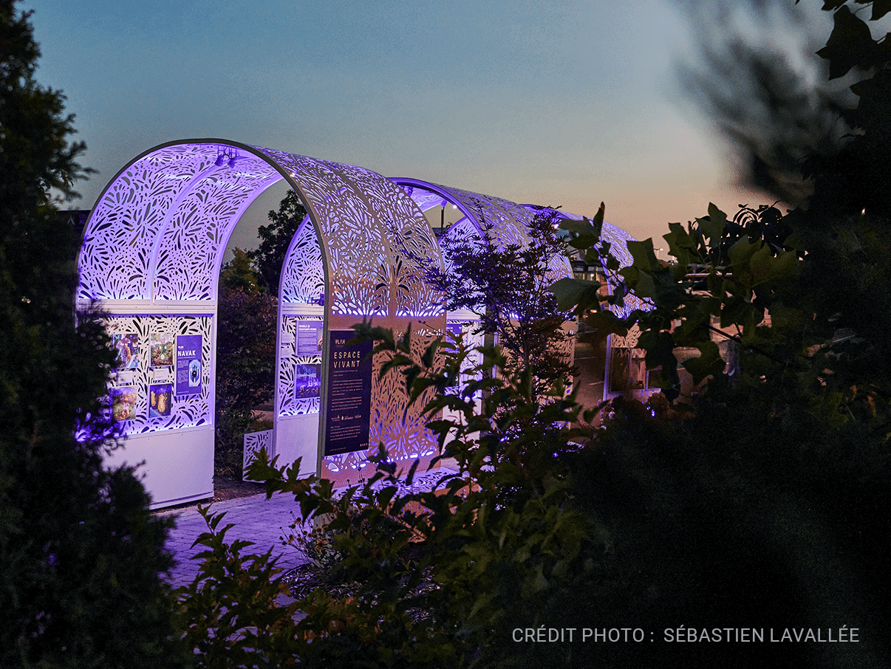
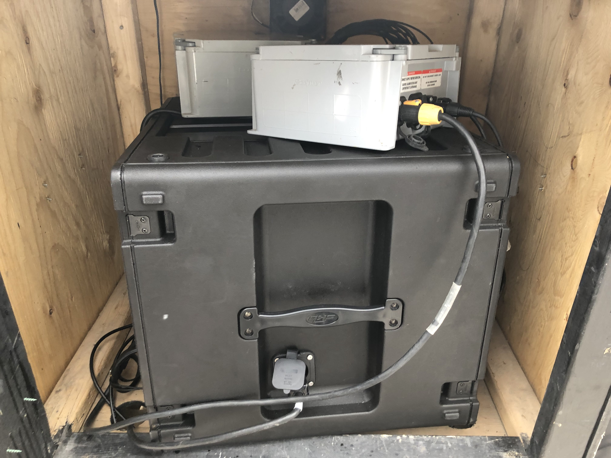
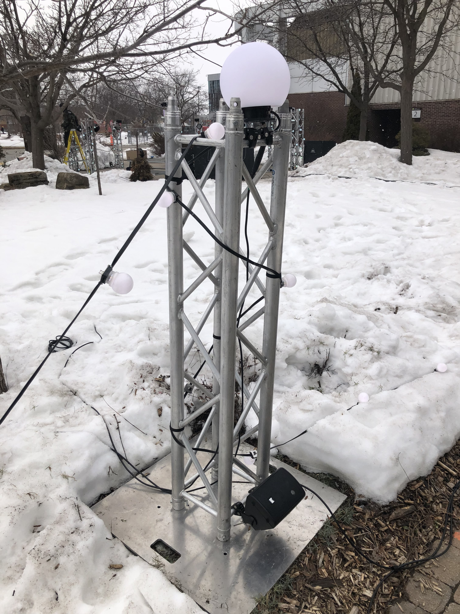
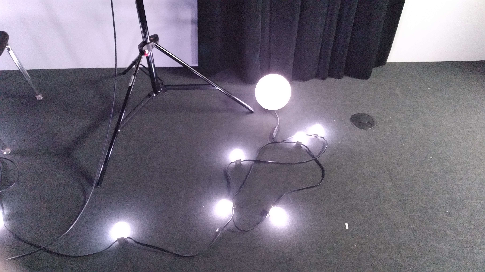
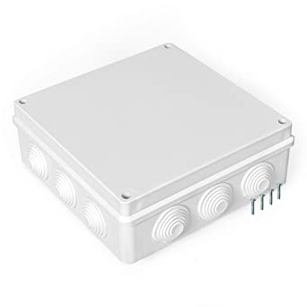

<h1> Nom de l'événement : Mycélium </h1> 

 

  <h3>Lieu de mise en exposition :</h3>
Collège Montmorency (475 Bd de l'Avenir, Laval, QC H7N 5H9) 

  <h3> Type d'exposition :</h3>
Temporaire et extérieure
  <h3> Date de ma visite :</h3>
24 février 2023
  <h3> Titre de l'oeuvre :</h3>
Nexum    

  <h5>Source de la photo : https://tim-montmorency.com/2023/projets/Nexum/docs/web/index.html </h5>
  <h3>Nom des artistes :</h3>
  
  * Sébastien Reilly
  * Sabrina Laforest
  * Alexandre Daniel
  * Maxime Des Lauriers
  <h3>Date de réalisation :</h3>
  2023  
  <h3>Description de l'oeuvre :</h3>

Pour commencer, je n'ai pas trouvé le cartel de l'œuvre d'art, ou du moins je pense avoir complètement oublié de la prendre en photo. Néanmoins, je vais la décrire. Cette œuvre consiste à décorer un long chemin avec des guirlandes de lumières. Bien que cela puisse sembler simple, c'est en réalité bien plus complexe que ce que vous pensez. Tout d'abord, les guirlandes sont équipées de détecteurs de mouvement qui les allument en vagues lorsque vous passez devant, évitant ainsi une utilisation inutile de l'énergie et ajoutant une touche de surprise lorsque vous êtes en face. Les lumières sont contenues dans des bulles de plastique dur et rondes qui procurent une sensation de confort lors de la traversée. De plus, je pense que le fait d'avoir installé cette œuvre devant un cégep aide à réduire le stress des étudiants pendant leurs sessions, même si cela ne dure que quelques minutes. Je suis d'avis que c'est l'intention qui compte.

  <h3> Type d'installation :</h3>
Interactive

    <table>
	    <tr>
    	    <td style="padding:10px">
        	     
      	    </td>
            <td style="padding:10px">
            	
            </td>
            <td style="padding:10px">
            	
            </td>
        </tr>
    </table>

  <h3> Fonction du dispositif multimédia : </h3>

Inspiré par la communication relativement méconnue des champignons via leur mycélium, ce projet donne à voir et à entendre des phénomènes audiovisuels provenant d’une nature technologique imaginaire. Ce projet propose un regard contemporain sur l’anthropocène observé depuis la perspective d’une nature sensible et interactive. 
  <h4>Source : EXTRAITS DE LA RÉPONSE À L'APPEL DE PROJETS CONCOURS ESPACE CRÉATIF 2022-2023 EN ARTS NUMÉRIQUES DU PLAN (Pôle lavallois d'enseignement supérieur en arts numériques et en économie créative)</h4>

<h3>Mise en place : </h3>
Cette œuvre d'art est située à l'extérieur du Collège Montmorency. Elle occupe l'espace de la petite cour à l'avant, avec des chemins respectifs reliant les entrées du collège. Le projet est disposé sur des rangées de câbles qui maintiennent les lumières en l'air. Il y a également des poteaux en métal qui supportent l'équipement électrique pour éviter qu'il ne soit recouvert de neige.

<h3> Compossantes : </h3>

* 8 Hauts-parleurs
* 8 boules lumineuses
* Boite central (Interieur inconnue)
* Rouleau de lumières DEL 
* 10 Poteaux en métal

    <table>
	    <tr>
    	    <td style="padding:10px">
        	     
      	    </td>
            <td style="padding:10px">
            	
            </td>
            <td style="padding:10px">
            	
            </td>
        </tr>
    </table>

<h3>Éléments nécessaires à la mise en exposition </h3>

* Boite "waterproof"
* Protecteurs de cables waterproof
* speakers waterproof

  <h5>Source:https://www.amazon.ca/-/fr/Bo%C3%AEte-d%C3%A9rivation-%C3%A9lectrique-ext%C3%A9rieure-%C3%A9lectroniques/dp/B08JDX7Z8M </h5>

<h3>Expérience vécue</h3>
L'œuvre s'active lorsque le visiteur passe devant les détecteurs de mouvement, situés aux extrémités des chemins. Il est important de suivre le chemin désiré et de ne pas passer entre les chemins de terre, car cela risquerait de ne pas être détecté par l'œuvre. En résumé, il suffit de passer devant les détecteurs et de profiter du moment en suivant le chemin choisi. Personnellement, lors de ma visite, j'ai beaucoup apprécié cette idée. Bien qu'elle puisse sembler banale, il faut la voir pour la ressentir. Ne pas emprunter ce chemin serait une grande perte, j'ai adoré le moment que j'ai passé là-bas.

	<h3> Ce que j'ai aimé : </h3>
J'apprécie également l'idée d'illuminer, littéralement, les chemins que nous empruntons au quotidien. Cela peut sembler métaphorique, mais j'aime le fait que plutôt que de tout changer, nous améliorons simplement ce que nous parcourons.

	<h3> Ce que je n'aime pas trop </h3>
Même s'il n'avait pas le choix, je n'aurais pas présenté ce projet pendant l'hiver. Bien qu'il réchauffe nos cœurs pendant une période glaciale de l'année, je pense qu'il serait moins difficile à reproduire pendant l'été, nécessitant ainsi moins de travail. Cela étant dit, je les félicite d'avoir tout de même réussi à surmonter cette épreuve.

	<h3> Référence</h3> 

	
* https://tim-montmorency.com/2023/
* https://www.amazon.ca/-/fr/Bo%C3%AEte-d%C3%A9rivation-%C3%A9lectrique-ext%C3%A9rieure-%C3%A9lectroniques/dp/B08JDX7Z8M?th=1
* https://polelavalartnumerique.com/evenements/inauguration-espace-vivant/

  
  
 
  

  

