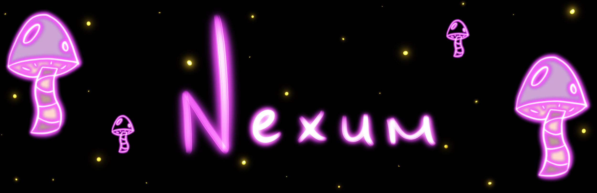

<h1> Nom de l'événement : Mycélium </h1> 

 

  <h3>Lieu de mise en exposition :</h3>
Collège Montmorency (475 Bd de l'Avenir, Laval, QC H7N 5H9) 

  <h3> Type d'exposition :</h3>
Temporaire et extérieure
  <h3> Date de ma visite :</h3>
24 février 2023
  <h3> Titre de l'oeuvre :</h3>
Nexum    

  <h5>Source de la photo : https://tim-montmorency.com/2023/projets/Nexum/docs/web/index.html </h5>
  <h3>Nom des artistes :</h3>
  
  * Sébastien Reilly
  * Sabrina Laforest
  * Alexandre Daniel
  * Maxime Des Lauriers
  <h3>Date de réalisation :</h3>
  2023  
  <h3>Description de l'oeuvre :</h3>

Pour commencer, je n'ai pas trouvé le cartel de l'œuvre d'art, ou du moins je pense avoir complètement oublié de la prendre en photo. Néanmoins, je vais la décrire. Cette œuvre consiste à décorer un long chemin avec des guirlandes de lumières. Bien que cela puisse sembler simple, c'est en réalité bien plus complexe que ce que vous pensez. Tout d'abord, les guirlandes sont équipées de détecteurs de mouvement qui les allument en vagues lorsque vous passez devant, évitant ainsi une utilisation inutile de l'énergie et ajoutant une touche de surprise lorsque vous êtes en face. Les lumières sont contenues dans des bulles de plastique dur et rondes qui procurent une sensation de confort lors de la traversée. De plus, je pense que le fait d'avoir installé cette œuvre devant un cégep aide à réduire le stress des étudiants pendant leurs sessions, même si cela ne dure que quelques minutes. Je suis d'avis que c'est l'intention qui compte.

  <h3> Type d'installation :</h3>
Interactive

    <table>
	    <tr>
    	    <td style="padding:10px">
        	     
      	    </td>
            <td style="padding:10px">
            	
            </td>
            <td style="padding:10px">
            	
            </td>
        </tr>
    </table>

  <h3> Fonction du dispositif multimédia : </h3>
  <h4> Compossantes : </h4>

* 8 Hauts-parleurs
* 8 boules lumineuses
* Boite central (Interieur inconnue)
* Rouleau de lumières DEL 
* 10 Poteaux en métal

<h4> 

  
  
 
  

  

