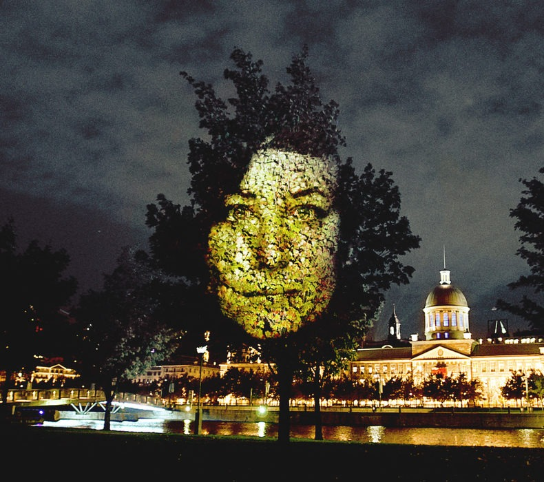
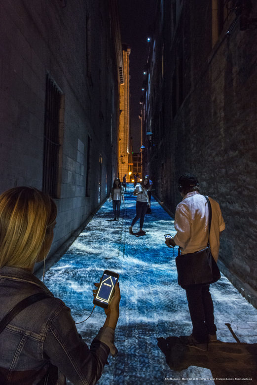
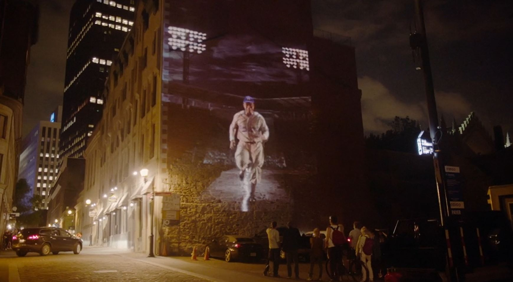
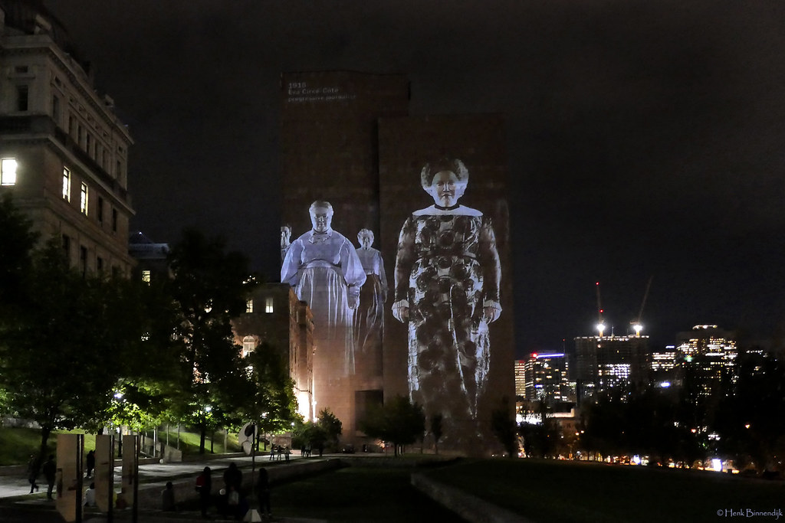

<h1> Nom de l'exposition : Cité Mémoire </h1>  
 
<h2> lieu de mise en exposition :</h2>
<h4> Le vieux-Montréal en général </h4>  

<h2> Type d'exposition : </h2>
<h4> Permanente et exterieure </h4>
<h2> Titre de l'oeuvre :</h2>
<h4> multiple oeuvre présenté lors de l'événement</h4>  
 
<h2> Nom des artiste : </h2>
<h4> Installation de Michel Lemieux et Victor Pilon </h4>
<h2> Année de réalisation :</h2>
<h4> 2007 </h4>
<h2> Description de l'oeuvre :</h2>
<h4> La Cité Mémoire, la plus grande piste vidéo au monde, est située au cœur de Montréal. Plus de 25 tableaux se déploient avec des images, des mots et de la musique, animés d'un souffle tantôt joyeux, tantôt poétique. </h4>  

<h2> Type d'installation :</h2>
<h4> Immersive et interactive</h4>
La vidéo parlante ! : https://youtu.be/01P0BoyuPHY
<h2> Fonction du dispositif multimedia :</h2>
<h4> Démontre et mets vit à des personnages historiques à Montréal</h4>
<h2> Mise en espace :</h2> 
<h4> De nombreuses oeuvres sont projetées sur les murs du vieux Montréal, elle occupe la majeure partie du mur lorsque des événements se déroulent, cette oeuvre est principalement disposée par des projecteurs sur les murs des vieux immeubles.</h4>
<h2> Composantes et techniques :</h2>
<h4> Des projecteurs...?</h4>
<h2> Les éléments nécessaires a la mise en exposition </h2>
<h4> <h/4>
<h2> Expérience vécue</h2>
<h4> </h4>
<h2> Ce que j'ai aimé :</h2>
 <h4>...</h4>
 <h2>

 

 

